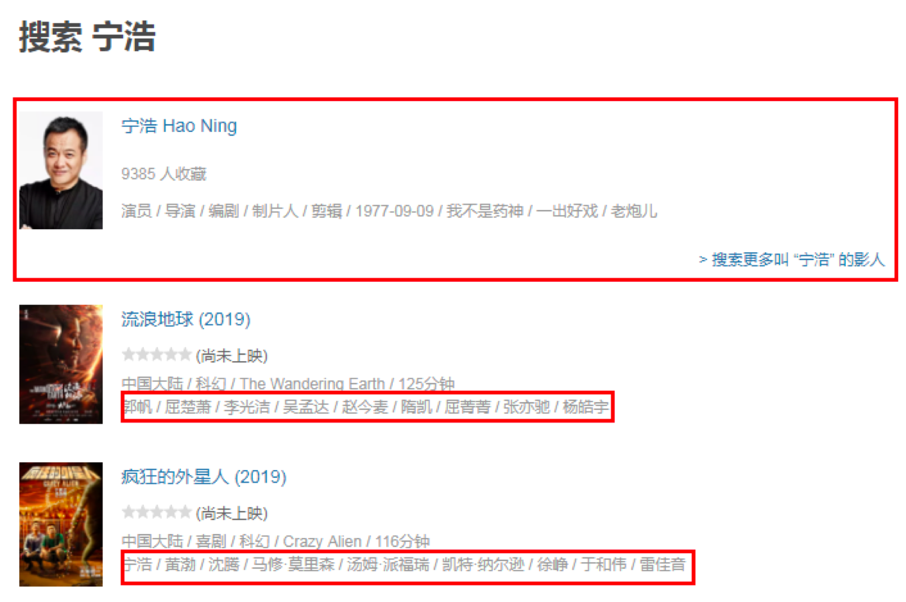

# 电影数据集关联规则挖掘：

关联规则挖掘在生活中有很多使用场景，不仅是商品的捆绑销售，甚至在挑选演员决策上，你也能通过关联规则挖掘看出来某个导演选择演员的倾向。

### 如何使用Apriori工具包

Apriori虽然是十大算法之一，不过在sklearn工具包中并没有它，也没有FP-Growth算法。这里教你个方法，来选择Python中可以使用的工具包，你可以通过<https://pypi.org/> 搜索工具包。


这个网站提供的工具包都是Python语言的，你能找到8个Python语言的Apriori工具包，具体选择哪个呢？建议你使用第二个工具包，即efficient-apriori。后面我会讲到为什么推荐这个工具包。

首先你需要通过pip install efficient-apriori 安装这个工具包。

然后看下如何使用它，核心的代码就是这一行：

```
itemsets, rules = apriori(data, min_support,  min_confidence)
```

其中data是我们要提供的数据集，它是一个list数组类型。min_support参数为最小支持度，在efficient-apriori工具包中用0到1的数值代表百分比，比如0.5代表最小支持度为50%。min_confidence是最小置信度，数值也代表百分比，比如1代表100%。

关于支持度、置信度和提升度，我们再来简单回忆下。

支持度指的是某个商品组合出现的次数与总次数之间的比例。支持度越高，代表这个组合出现的概率越大。

置信度是一个条件概念，就是在A发生的情况下，B发生的概率是多少。

提升度代表的是“商品A的出现，对商品B的出现概率提升了多少”。

接下来我们用这个工具包，跑一下上节课中讲到的超市购物的例子。下面是客户购买的商品列表：


具体实现的代码如下：

```
from efficient_apriori import apriori
# 设置数据集
data = [('牛奶','面包','尿布'),
           ('可乐','面包', '尿布', '啤酒'),
           ('牛奶','尿布', '啤酒', '鸡蛋'),
           ('面包', '牛奶', '尿布', '啤酒'),
           ('面包', '牛奶', '尿布', '可乐')]
# 挖掘频繁项集和频繁规则
itemsets, rules = apriori(data, min_support=0.5,  min_confidence=1)
print(itemsets)
print(rules)
```

运行结果：

```
{1: {('啤酒',): 3, ('尿布',): 5, ('牛奶',): 4, ('面包',): 4}, 2: {('啤酒', '尿布'): 3, ('尿布', '牛奶'): 4, ('尿布', '面包'): 4, ('牛奶', '面包'): 3}, 3: {('尿布', '牛奶', '面包'): 3}}
[{啤酒} -> {尿布}, {牛奶} -> {尿布}, {面包} -> {尿布}, {牛奶, 面包} -> {尿布}]
```

你能从代码中看出来，data是个List数组类型，其中每个值都可以是一个集合。实际上你也可以把data数组中的每个值设置为List数组类型，比如：

```
data = [['牛奶','面包','尿布'],
           ['可乐','面包', '尿布', '啤酒'],
           ['牛奶','尿布', '啤酒', '鸡蛋'],
           ['面包', '牛奶', '尿布', '啤酒'],
           ['面包', '牛奶', '尿布', '可乐']]
```

两者的运行结果是一样的，efficient-apriori 工具包把每一条数据集里的项式都放到了一个集合中进行运算，并没有考虑它们之间的先后顺序。因为实际情况下，同一个购物篮中的物品也不需要考虑购买的先后顺序。

而其他的Apriori算法可能会因为考虑了先后顺序，出现计算频繁项集结果不对的情况。所以这里采用的是efficient-apriori这个工具包。

### 挖掘导演是如何选择演员的

在实际工作中，数据集是需要自己来准备的，比如今天我们要挖掘导演是如何选择演员的数据情况，但是并没有公开的数据集可以直接使用。因此我们需要使用之前讲到的Python爬虫进行数据采集。

不同导演选择演员的规则是不同的，因此我们需要先指定导演。数据源我们选用豆瓣电影。

先来梳理下采集的工作流程。

首先我们先在<https://movie.douban.com>搜索框中输入导演姓名，比如“宁浩”。


页面会呈现出来导演之前的所有电影，然后对页面进行观察，你能观察到以下几个现象：

1. 页面默认是15条数据反馈，第一页会返回16条。因为第一条数据实际上这个导演的概览，你可以理解为是一条广告的插入，下面才是真正的返回结果。
2. 每条数据的最后一行是电影的演出人员的信息，第一个人员是导演，其余为演员姓名。姓名之间用“/”分割。

有了这些观察之后，我们就可以编写抓取程序了。在代码讲解中你能看出这两点观察的作用。抓取程序的目的是为了生成宁浩导演（你也可以抓取其他导演）的数据集，结果会保存在csv文件中。完整的抓取代码如下：

```python
# -*- coding: utf-8 -*-
from efficient_apriori import apriori
from lxml import etree
import time
from selenium import webdriver
import csv
driver = webdriver.Chrome()
# 设置想要下载的导演 数据集
director = u'宁浩'
# 写CSV文件
file_name = './' + director + '.csv'
base_url = 'https://movie.douban.com/subject_search?search_text='+director+'&cat=1002&start='
out = open(file_name,'w', newline='', encoding='utf-8-sig')
csv_write = csv.writer(out, dialect='excel')
# 下载指定页面的数据
def download(request_url):
     driver.get(request_url)
     time.sleep(1)
     html = driver.find_element_by_xpath("//*").get_attribute("outerHTML")
     html = etree.HTML(html)
     # 设置电影名称，导演演员 的XPATH
     movie_lists = html.xpath("/html/body/div[@id='wrapper']/div[@id='root']/div[1]//div[@class='item-root']/div[@class='detail']/div[@class='title']/a[@class='title-text']")
     name_lists = html.xpath("/html/body/div[@id='wrapper']/div[@id='root']/div[1]//div[@class='item-root']/div[@class='detail']/div[@class='meta abstract_2']")
     # 获取返回的数据个数
     num = len(movie_lists)
     if num > 15: #第一页会有16条数据
           # 默认第一个不是，所以需要去掉
           movie_lists = movie_lists[1:]
           name_lists = name_lists[1:]
     for (movie, name_list) in zip(movie_lists, name_lists):
           # 会存在数据为空的情况
           if name_list.text is None: 
                continue
           # 显示下演员名称
           print(name_list.text)
           names = name_list.text.split('/')
           # 判断导演是否为指定的director
           if names[0].strip() == director:
                # 将第一个字段设置为电影名称
                names[0] = movie.text
                csv_write.writerow(names)
     print('OK') # 代表这页数据下载成功
     if num >= 15:
           # 继续下一页
           return True
     else:
           # 没有下一页
           return False
 
# 开始的ID为0，每页增加15
start = 0
while start<10000: #最多抽取1万部电影
     request_url = base_url + str(start)
     # 下载数据，并返回是否有下一页
     flag = download(request_url)
     if flag:
           start = start + 15
     else:
           break
out.close()
print('finished')
```

代码中涉及到了几个模块，我简单讲解下这几个模块。

在引用包这一段，我们使用csv工具包读写CSV文件，用efficient_apriori完成Apriori算法，用lxml进行XPath解析，time工具包可以让我们在模拟后有个适当停留，代码中我设置为1秒钟，等HTML数据完全返回后再进行HTML内容的获取。使用selenium的webdriver来模拟浏览器的行为。

在读写文件这一块，我们需要事先告诉python的open函数，文件的编码是utf-8-sig（对应代码：encoding=‘utf-8-sig’），这是因为我们会用到中文，为了避免编码混乱。

编写download函数，参数传入我们要采集的页面地址（request_url）。针对返回的HTML，我们需要用到之前讲到的Chrome浏览器的XPath Helper工具，来获取电影名称以及演出人员的XPath。我用页面返回的数据个数来判断当前所处的页面序号。如果数据个数>15，也就是第一页，第一页的第一条数据是广告，我们需要忽略。如果数据个数=15，代表是中间页，需要点击“下一页”，也就是翻页。如果数据个数<15，代表最后一页，没有下一页。

在程序主体部分，我们设置start代表抓取的ID，从0开始最多抓取1万部电影的数据（一个导演不会超过1万部电影），每次翻页start自动增加15，直到flag=False为止，也就是不存在下一页的情况。

你可以模拟下抓取的流程，获得指定导演的数据，比如我上面抓取的宁浩的数据。这里需要注意的是，豆瓣的电影数据可能是不全的，但基本上够我们用。


有了数据之后，我们就可以用Apriori算法来挖掘频繁项集和关联规则，代码如下：

```python
# -*- coding: utf-8 -*-
from efficient_apriori import apriori
import csv
director = u'宁浩'
file_name = './'+director+'.csv'
lists = csv.reader(open(file_name, 'r', encoding='utf-8-sig'))
# 数据加载
data = []
for names in lists:
     name_new = []
     for name in names:
           # 去掉演员数据中的空格
           name_new.append(name.strip())
     data.append(name_new[1:])
# 挖掘频繁项集和关联规则
itemsets, rules = apriori(data, min_support=0.5,  min_confidence=1)
print(itemsets)
print(rules)
```

代码中使用的apriori方法和开头中用Apriori获取购物篮规律的方法类似，比如代码中都设定了最小支持度和最小置信系数，这样我们可以找到支持度大于50%，置信系数为1的频繁项集和关联规则。

这是最后的运行结果：

```
{1: {('徐峥',): 5, ('黄渤',): 6}, 2: {('徐峥', '黄渤'): 5}}
[{徐峥} -> {黄渤}]
```

你能看出来，宁浩导演喜欢用徐峥和黄渤，并且有徐峥的情况下，一般都会用黄渤。你也可以用上面的代码来挖掘下其他导演选择演员的规律。

### 总结

Apriori算法的核心就是理解频繁项集和关联规则。在算法运算的过程中，还要重点掌握对支持度、置信度和提升度的理解。在工具使用上，你可以使用efficient-apriori这个工具包，它会把每一条数据中的项（item）放到一个集合（篮子）里来处理，不考虑项（item）之间的先后顺序。

在实际运用中你还需要灵活处理，比如导演如何选择演员这个案例，虽然工具的使用会很方便，但重要的还是数据挖掘前的准备过程，也就是获取某个导演的电影数据集。


